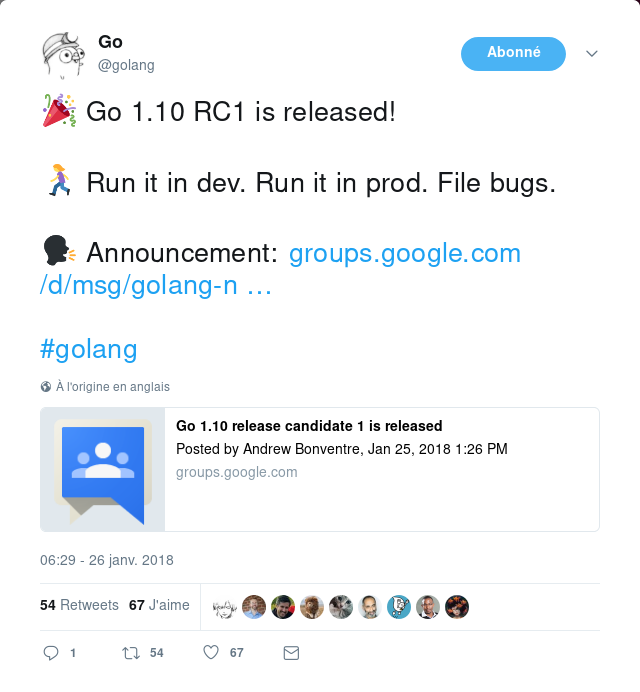
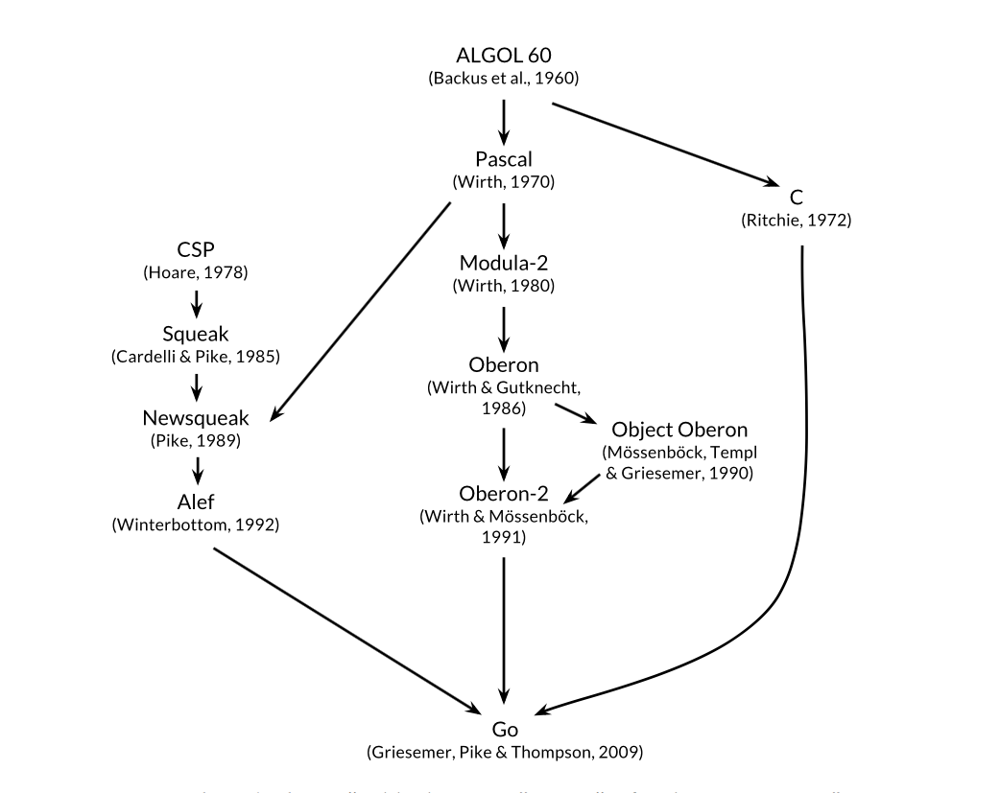
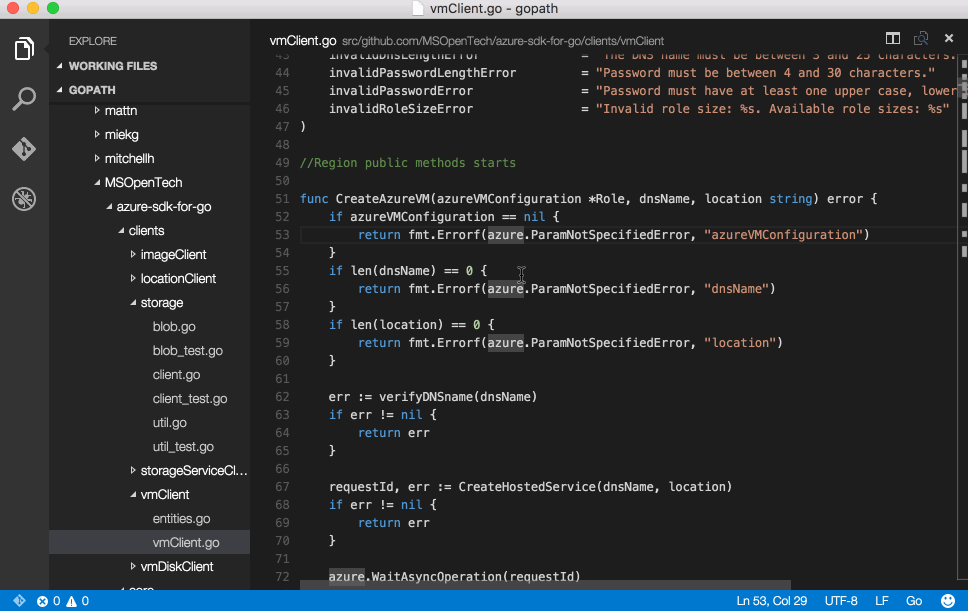
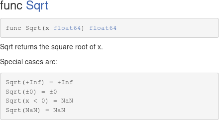
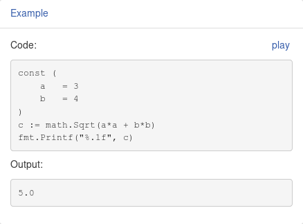

title: Go(tools) 101 !
class: animation-fade
layout: true

.bottom-bar[
  {{title}} / SnowCamp 2018
]

---
class: impact

# {{title}}
## Go, du langage aux outils.


---

## Je suis qui ?

.col-3[
    
]
.col-6[
### Siegfried Ehret

- Développeur chez [SFEIR](http://www.sfeir.com/)
- Je traîne sur l'internet:
    - [twitter.com/SiegfriedEhret](https://twitter.com/SiegfriedEhret)
    - [mastodon.social/@SiegfriedEhret](https://mastodon.social/@SiegfriedEhret)

[french gopher ! (frenchgo.fr)](https://frenchgo.fr/)
]

???

- J'ai joué avec Go de façon perso pendant un moment suite à une fatigue liée au JS
- Maintenant j'en fais au boulot !

---

## Légende

💡 Les tips

🚨 Là où il faut se renseigner ou faire attention

🔨 Il y a un outil pour ça

🔧 Pour aller plus loin

???

💡 Les tips

🚨 Là où il faut se renseigner ou faire attention

🔨 Il y a un outil pour ça

🔧 Pour aller plus loin

---

## 🎉

.center[
[](https://twitter.com/golang/status/956640171050586113)
]

???

- Annoncé hier, Go 1.10 RC1 !
- La finale doit arriver en février.

- Mise à jour des outils de builds, performances.
- On peut Math.Round :p

- Go 1.11 est déjà prévu (ils en causent dans les notes de version)

---

## Il était une fois...

.col-6[
- Initié en 2007
- Apparu le 10 novembre 2009
- Chez Google
- Créé par Robert Griesemer, Rob Pike, Ken Thompson
]
.col-3[
<!-- pouet -->
<div></div>
]
.col-3.right[
  
]

???

- Vous avez déjà vu un gopher ?
- Griesemer: JVM
- Rob Pike: Unix / UTF-8
- Ken Thompson: B, C, Unix, UTF-8

Du coup ça a bien grandi...

Même légèrement en France !

---

## Kikifédugo ?

.col-6[
### Projets

- Caddy
- Docker
- Gogs
- Hugo
- Kubernetes
- Prometheus
- Terraform
- Traefik
]

???

### Projets

- Docker
- Kubernetes

--

.col-6[
### Boîtes

- Blablacar
- Cozy
- Datadog
- Dailymotion
- Leboncoin
- Red Hat
- Zalando
]

???

### Boîtes

- Blablacar
- Cozy
- Datadog
- Dailymotion
- Leboncoin
- Zalando

---

class: impact-section

# Go !

???

C'est parti !

---

## Ça vient d'où ?

.center[]

???

- Une branche C
- Une branche avec des trucs bizarres (Pascal) au milieu
- Une branche CSP (concurrence)

(next) L'Algol non, mais l'eau ferrugineuse, oui !

---
class: impact-section

## L'Algol non, mais l'eau ferrugineuse, oui !

???

> L'Algol non, mais l'eau ferrugineuse, oui !

---

## Les variables d'environnement

- **$GOROOT** : votre installation de Go
- **$GOPATH** : en Go 1.8, par défaut à $HOME/go

???

- `$GOPATH` est encore souvent utile !
- monorepo → config du `$GOPATH` au root et pouf ça fonctionne.

---

## C'est l'histoire d'un $GOPATH...

- bin/ : binaires
- pkg/ : les objets quand on compile des trucs
- src/ : les sources

???

- `src` pour les sources
- `bin` pour les binaires compilés
- `pkg` pour les trucs entre les deux :)

--
    - github.com/
        - SiegfriedEhret/
            - monprojet/

???

- `src` est organisé en arborescence
    - repo
    - puis username
    - puis projet

---

## Quelques commandes

- **go build**: compile le programme et ses dépendances

???

- **go build**: compile le programme et ses dépendances
- **go test**: lance les tests
- **go get**: télécharge une dépendance
- **go install**: compile le programme et le copie dans $GOPATH/bin/
- **go run**: compile et lance le programme
- Et plein d'autres ! Essayez `go help` ;)

--

- **go test**: lance les tests

???

- **go test**: lance les tests

--

- **go get**: télécharge une dépendance

???

- **go get**: télécharge une dépendance

--

- **go install**: compile le programme et le copie dans $GOPATH/bin/

???

- **go install**: compile le programme et le copie dans $GOPATH/bin/

--

- **go run**: compile et lance le programme

???

- **go run**: compile et lance le programme


---

class: impact-section

# Le langage

---

## Mots-clés

- **Dépendances** : import package
???
- **Dépendances** : import package
--

- **Conditionnelles** : if else switch case break default fallthrough goto select
???
- **Conditionnelles** : if else switch case break default fallthrough goto select
--

- **Itérations** : for range continue
???
- **Itérations** : for range continue
--

- **Type** : var func interface struct chan const type map
???
- **Type** : var func interface struct chan const type map
--

- **Misc** : defer go return panic recover
???
- **Misc** : defer go return panic recover

---

## Noms prédéclarés

- **Constantes**: true false iota nil

???

- **Constantes**: true false iota nil

--

- **Fonctions**: 
    - make len cap new append copy close delete
    - complex real imag 
    - panic recover

???

- **Fonctions**: 
    - make len cap new append copy close delete
    - complex real imag 
    - panic recover

--

- **Types**:
    - int  int8  int16  int32  int64
    - uint uint8 uint16 uint32 uint64 uintptr
    - float32 float64 complex64 complex128
    - bool byte rune string error

???

- **Types**:
    - int  int8  int16  int32  int64
    - uint uint8 uint16 uint32 uint64 uintptr
    - float32 float64 complex64 complex128
    - bool byte rune string error
    
---

## "Hello, world"

```go
package main

import "fmt"

func main() {
	fmt.Println("Hello, 世界")
}
```

???

- On remarque qu'on peut mettre des caractères bizarres !

--

- Le `package main` et la `func main()` définissent le point d'entrée du programme.

???

- `package main` et `func main()`
--

- 💡 Il y a aussi une fonction `init()` appelée avant `main()` !

???

- 💡 `init()`
--

- 🚨 Sur Appengine, on fait du go bizarre ! (voir le [getting started](https://cloud.google.com/appengine/docs/standard/go/quickstart)).

???

- 🚨 Sur Appengine

---

## Imports

.col-4[
- Unique:

```go
import "fmt"
```
]

???

- Import unique

--

.col-1[
<!-- pouet -->
<div></div>
]
.col-7[
- Multiple: 

```go
import (
	"fmt"
	"math/rand"
	log "github.com/sirupsen/logrus"
	_ "github.com/go-sql-driver/mysql"
)
```
]

???

- Import multiple
- Import nommé
- Import anonyme (avec `_` sinon goimports trash le truc)

--

🔨 On verra `goimports` plus loin !

---

## Variables et constantes

- `var i int`, `var i int = 9000`, `i := 9000`

???

- Plusieurs façons
- On peut laisser Go trouver le type

--

- Groupées avec `()` comme pour les import:
```go
var (
        i int = 9000
        j     = 9001
)
```

???

- On peut les grouper

--

- `const` (pas de `:=` !)

???

- On peut faire des constantes

--

- **`P`**ublique ou **`p`**rivée

???

- **`P`**ublique ou **`p`**rivée


--

🔨 On verra `gofmt`/`go fmt` plus loin !

???

- On ne va pas indenter à la main quand même...

---

## If

```go
if condition {
    // instructions
}
```

On peut trouver aussi:

```go
if expression; condition {
    // instructions
}
```

---

## Fonctions

- Fonction = valeur

???

- On peut passer une fonction à une fonction, et une fonction peut retourner une fonction !

--

- Peuvent retourner plusieurs valeurs

???

- Peuvent retourner plusieurs valeurs
- Convention: L'erreur en dernier

--

- **`P`**ublique ou **`p`**rivée

???

- **`P`**ublique ou **`p`**rivée

--

- 💡 `defer`

???

- 💡 `defer`

---

## Valeurs «zéro»

- `false` pour les types booléen

- `0` et `0.0` pour nombres entiers et flottants

- `""` pour les chaînes de caractères

- `nil` pour les pointeurs, fonctions, interfaces, slices, channels et maps

???

- Si on a des valeurs «zéros», comment on fait pour savoir si c'est une valeur initialisée ou pas ? (NEXT)
--

💡 `value, ok` !

---

## For, while, loop...

Juste `for` !

```go
for i := 0; i < 5; i++ {
    fmt.Println(i)
}
```

--

```go
a := []string{"foo", "bar", "baz", "qux"}
for index, value := range a {
    fmt.Println(index, value)
}
```

???

On utilise `range` pour les maps, et on a le fameux `ok` dont on parlait pour identifier les valeurs pas zéro !

---

## Array / Slice

```go
var myArray [10]int
var mySlice []int
```

- Les arrays:
    - ont une taille fixe qui fait partie du type
    - sont initialisés aux «valeurs zéros»

???

- Array
    - taille fixe
    - la taille fait partie du type
    - initialisé aux «valeurs zéros
--

- Les slices:
    - ont une longueur et une capacité
    - sont redimensionnables
    - une slice de slice (`mySlice[1:3]`) partage le même espace mémoire !

???

- Slices
    - longueur + capacité
    - Redimentionnables
    - une slice de slice (`mySlice[1:3]`) partage le même espace mémoire !

--

Mots clés utiles: `make`, `len`, `cap`, `append`, `copy`

---

## Map

```go
var sfeir = make(map[string]int)
sfeir["Siegfried"] = 34

// sfeir := map[string]int{
//    "Siegfried": 34,
// }

age1, ok1 := sfeir["Siegfried"]
age2, ok2 := sfeir["彩子"]

fmt.Println(age1, ok1, age2, ok2)
```

???

- On peut init une map de plusieurs façons
- Si j'ai ce petit bout de code...

--

Résultat: `34 true 0 false`

--

Mots clés utiles: `make`, `len`, `delete`, `range`

---

## Struct

On peut créer des types regroupant plusieurs propriétés:

```go
type Point struct {
    X, Y int
}

p := Point{1, 2}
```

???

- Une struct = un type
- Ensemble de propriétés (on peut les regrouper par types)

---

## Struct

Et comment on ajoute des méthodes à notre struct ?

???

Et comment on ajoute des méthodes à notre struct ?

=> On déclare une fonction avec un «receiver»

--


```go
func (p Point) String() string {
    return fmt.Sprintf("%d, %d", p.X, p.Y)
}
```

---

## Iota

```go
type ByteSize float64

const (
	_           = iota // ignore first value by assigning to blank identifier
	KB ByteSize = 1 << (10 * iota)
	MB
	GB
	TB
	PB
	EB
	ZB
	YB
)
```

[spec](http://golang.org/doc/go_spec.html#Iota) et [wiki](https://github.com/golang/go/wiki/Iota)

???

Iota, c'est pas le mec tout vert dans Star Wars !

---

## Interface

- Une interface, c'est un type !
- Contient un ensemble de définition de méthodes

--

.col-6[
Si on a :
```go
type Aigle struct {}
func (a Aigle) Mange() { /*...*/ }
func (a Aigle) Vole() { /*...*/ }
```
]

???

Si on a une struct avec 2 fonctions.

--

.col-6[
Et :
```go
type Oiseau interface {
	Mange()
	Vole()
}
type Avion interface { Vole() }
```
]

???

Et qu'on a ces 2 interfaces...

--

→ Quelle(s) interface(s) Aigle implémente-t-il ?

???

Notre struct implémente... Les 2 !

---

## Interface 🚨

Si on fait:

```go
var dataSlice []int = foo()
var interfaceSlice []interface{} = dataSlice
```

???

À votre avis, ça fonctionne ?

--

À la compilation:

```bash
cannot use dataSlice (type []int) as type []interface { } in assignment
```

🔧 [En savoir plus](https://github.com/golang/go/wiki/InterfaceSlice)

???

Et non !

- «array avec éléments de type int»
- => «type = array avec éléments de type int»
- Idem de l'autre côté !

---

## Pointeurs

Par défaut en Go: «pass by value».

```go
    x := 1
    p := &x
    fmt.Println(*p) // 1
    *p = 2
    fmt.Println(x) // 2
```

--

### Comment survivre avec les pointeurs ?

--

> Si ça ne marche pas, mettre `&`.

--

> Si ça marche pas, mettre `*`.

--

> Si ça ne marche pas, tout réécrire... 😅

---

## if err != nil ... if err != nil ... if err != nil ... 

Pas d'exception o_O

```go
f, err := os.Open("filename.ext")
if err != nil {
    log.Fatal(err)
}
```

???

Pas d'exception o_O

--

On peut créer des erreurs avec `errors.New("mon message d'erreur")`.

???

On peut créer des erreurs avec `errors.New("mon message d'erreur")`.

--

🔧 Voir l'article sur [defer, panic and recover](https://blog.golang.org/defer-panic-and-recover).

---

## Goroutines

«Thread super léger».

```go
func compute() {
    // do something
}

go compute()
```

???

- Vous avez déjà joué avec des threads en java ?
- C'était lourd hein ?
- Pas en go !

--

- 🚨 Il faut soigner ses goroutines !
- 💡 `sync.WaitGroup` 

???

- Quand le programme arrive au bout, ça quitte.
- Même s'il y a des goroutines qui traînent !
- Utiliser `sync.WaitGroup` pour gérer tout ça correctement

---

class:impact-section

## Do not communicate by sharing memory; 
## instead, share memory by communicating. 

[Go Proverbs, by Rob Pike](https://www.youtube.com/watch?v=PAAkCSZUG1cs)

???

Quand on a des goroutines qui traînent dans tous les sens, comment qu'on gère l'état de notre app ?

---

## Channels

Pour la création: 

```go
s := make(chan string)
```

--

Pour envoyer:

```go
s <- "foo"
```

--

Pour lire:

```go
value := <-s
```

🔧 [GopherCon 2017: Kavya Joshi - Understanding Channels](https://www.youtube.com/watch?v=KBZlN0izeiY)

---

## Goroutine + channel

```go
c := make(chan string)
go func() {
    c <- "foo"
}()
value, ok := <-c
fmt.Println(value, ok)
// foo, true (canal ouvert)
```

???

- Tout simplement
- C'est bloquant sur la réception de la valeur qui traîne dans le channel

---

## Goroutine + channel

```go
for {
    select {
    case c <- x:
        x, y = y, x+y
    case <-quit:
        fmt.Println("quit")
        return
    }
}
```

???

- On peut écouter sur plusieurs canaux
- Multiplexage !

---

## Type Assertions

```go
var x interface{} = 7
i, ok := x.(int)
```

???

- On l'a utilisé quand on lisait des valeurs d'un contexte lié à une requête
- Ça permet d'assert et de «caster»
- On retrouve notre `ok` !
- Si on ne met pas le ok, ça `panic` au runtime !

---

class: impact-section

# Librairie standard

---

## Plein de possibilités

[La liste des packages](https://golang.org/pkg/)

- crypto
- database
- html, html/template
- io, ioutil, bufio
- log
- math, math/rand
- os
- path, path/filepath
- time

---

## sort

Il faut importer le package `sort`.

```go
people := []struct {
    Name string
    Age  int
}{
    {"彩子", 32},
    {"Siegfried", 34},
}

sort.Slice(people, func(i, j int) bool { 
    return people[i].Name < people[j].Name 
})

fmt.Println("By name:", people)
// By name: [{彩子 32} {Siegfried 34}]
```

???

- Je le mets juste parce qu'avant c'était ennuyeux de faire un sort
- Il fallait 3 fonctions...

---

## CLI flags

Il faut importer le package `flag`.

```go
var (
	secret  string
)

func init() {
	flag.StringVar(&key, "key", "", "Your consumer key")
)

func main() {
    flag.Parse()
}
```

💡 Libs recommandées: [urface/cli](https://github.com/urfave/cli), [spf13/cobra](https://github.com/spf13/cobra), [mitchellh/cli](https://github.com/mitchellh/cli).

---

## JSON

Il faut importer le package `encoding/json`.

```go
people := struct {
    Name string `json:"name"`
    Age  int    `json:"age"`
}{
    Name: "Siegfried",
    Age:  33,
}

data, _ := json.Marshal(people)
fmt.Printf("%s\n", data)
// {"name":"Siegfried","age":33}
```

💡 Libs recommandées: [go-yaml](https://github.com/go-yaml/yaml)

???

- Pas de gestion d'erreur mais ne le dites pas


---

## Logging

🚨 le `log` en Go, c'est du faux

```go
package main

import "log"

func main() {
	log.Print("Hello, log file!")
}
```

💡 Libs recommandées:  [sirupsen/logrus](https://github.com/Sirupsen/logrus)

???

- `log` c'est tout nul

---

## Serveur HTTP

Il faut importer le package `net/http`.

```go
func handler(w http.ResponseWriter, r *http.Request) {
    fmt.Fprintf(w, "Hi there, I love %s!", r.URL.Path[1:])
}

http.HandleFunc("/", handler)
http.ListenAndServe(":8080", nil)
```

💡 Libs recommandées: [httprouter](https://github.com/julienschmidt/httprouter), [gorilla/mux](https://github.com/gorilla/mux), [negroni](https://github.com/urfave/negroni), [gin](https://github.com/gin-gonic/gin), [buffalo](https://gobuffalo.io/)

---

## Variables d'environnement

```go
var plop = os.Getenv("PLOP")
```

💡 `os.Environ()` qui est une map des variables
💡 Libs recommandées: (env)[https://github.com/caarlos0/env], (spf13/viper)[https://github.com/spf13/viper#working-with-environment-variables]

---

class: impact-section

# Les outils

---

## godef [🔗](https://github.com/rogpeppe/godef) et guru [🔗](https://godoc.org/golang.org/x/tools/cmd/guru)

.center[

]

???

- On ne s'en sert pas :p
- Informations sur le code

---

## godoc...

```bash
> godoc fmt Println

use 'godoc cmd/fmt' for documentation on the fmt command
func Println(a ...interface{}) (n int, err error)
    Println formats using the default formats for its operands and writes to
    standard output. Spaces are always added between operands and a newline
    is appended. It returns the number of bytes written and any write error
    encountered.
```

???

- On n'a pas toujours accès à l'internet !
- Donc on a la doc en local :)

--

On peut faire de la recherche !

```bash
godoc -q Println
```

---

## ... Et [godoc.org](godoc.org)

.col-6[

]
.col-6[

]

🔧 [«Godoc: documenting Go code»](https://blog.golang.org/godoc-documenting-go-code) (2011 !)

---

## go env

.col-6[
```bash
> go env
GOARCH="amd64"
GOBIN=""
GOEXE=""
GOHOSTARCH="amd64"
GOHOSTOS="linux"
GOOS="linux"
GOPATH="/home/siegfried/go"
GORACE=""
GOROOT="/usr/lib/go"
GOTOOLDIR="/usr/lib/go/pkg/tool/linux_amd64"
```
]
.col-6[
```bash
GCCGO="gccgo"
CC="gcc"
GOGCCFLAGS="-fPIC -m64 -pthread -fmessage-length=0 -fdebug-prefix-map=/tmp/go-build439272329=/tmp/go-build -gno-record-gcc-switches"
CXX="g++"
CGO_ENABLED="1"
CGO_CFLAGS="-g -O2"
CGO_CPPFLAGS=""
CGO_CXXFLAGS="-g -O2"
CGO_FFLAGS="-g -O2"
CGO_LDFLAGS="-g -O2"
PKG_CONFIG="pkg-config"
```
]

💡 Il y a plein de variable utiles pour les builds !

???

- La liste des variable pour l'environnement Go
- 💡 Il y a plein de variable utiles pour les builds !

---

### Cross compilation

Go peut compiler de n'importe quoi vers n'importe quoi ! (ou presque)

--

```bash
> GOOS=windows GOARCH=amd64 go build -o plop.exe plop.go
```

???

- Si je veux compiler sur mon linux pour Windows ou autre je peux !
- Attention dès qu'il y a des libs en C c'est mort

--

💡[gox](https://github.com/mitchellh/gox) pour faciliter tout ça

???

Un outil plutôt cool pour simplifier les builds

---

## go fix

(Ça a l'air cool mais je n'ai pas essayé !)

Permet de mettre à jour le code vers les nouvelles API lors des releases de Go.

Peut être un outil de migration à Go 2 (quand il sortira) ?

???

- Connais pas ^^'
- Migration Go 2 sans douleur avec ?

---

## go fmt / gofmt [🔗](https://golang.org/cmd/gofmt/)

```bash
gofmt -w yourcode.go
go fmt path/to/your/package
gofmt -r '"Hello, World" -> "Hello, 世界"' -w fmt.go
```

???

- Pas de débat !
- Avec un fichier ou un path
- On peut faire des règles de réécritures (avec des règles valides en Go)

---

## goimports [🔗](https://godoc.org/golang.org/x/tools/cmd/goimports)

```bash
> goimports -d imports.go 
diff -u imports.go.orig imports.go
-package main;
+package main
+
+import "fmt"
 
 func main() {
-       fmt.Println("Hello, World");
+       fmt.Println("Hello, World")
 }
```

???

- Avec `-d` ça fait un diff

--

- flag `-w` pour écrire le fichier
- 💡 Il fait le formatage en même temps !

???

- flag `-w` pour écrire le fichier
- 💡 Il fait le formatage en même temps !

---

## golint [🔗](https://github.com/golang/lint)

- Comme `gofmt` mais ça ne corrige pas.

- Ça se lance se la même façon.

???

- Comme `gofmt` mais ça ne corrige pas.

--

- 💡 C'est lui qui est utilisé dans les éditeurs/IDE pour vous dire ce qui ne va pas !

???

- 💡 C'est lui qui est utilisé dans les éditeurs/IDE pour vous dire ce qui ne va pas !

---

## gotype [🔗](https://godoc.org/golang.org/x/tools/cmd/gotype)

- Parcourt et type-check un package

```go
package main
import "fmt"
func main() {
        var toto string = 42
        fmt.Println(toto)
}
```

???

- On a un problème de type entre `string` et `42`.

--

```bash
> gotype type.go
type.go:6:20: cannot convert 42 (untyped int constant) to string
```

???

Et boum ça explose.

---

## go vet [🔗](https://golang.org/cmd/vet/)

```go
var toto = "toto"
fmt.Printf("%d", toto)
```

???

On a un problème de `%d` et `"toto"`

--

```bash
> go vet vet.go
vet.go:7: arg toto for printf verb %d of wrong type: string
exit status 1
```

???

- Et boum ça explose !
- `go vet` renvoie un code d'erreur
- C'est un bon outil à mettre en git hook ou dans les étapes de CI

---

## pprof (pour les barbu·es)

.center[


Voir [la doc](https://golang.org/pkg/net/http/pprof/) et un article de [rakyll](https://rakyll.org/pprof-ui/)
]

???

- Pour sortir ce qui traîne dans la heap, faire du profiling etc.
- Avec une UI Web pour Go 1.10 ! Navigation dans les stacks, flamegraphs...

---

class:impact-section

# Editeurs...

---

## On est bien couverts

.col-4[
### Éditeurs

- Atom ([go-plus](https://atom.io/packages/go-plus)).
- Sublime text ([GoSublime](https://github.com/DisposaBoy/GoSublime)).
- Vim ([vim-go](https://github.com/fatih/vim-go)).
- Visual Studio Code ([vscode-go](https://github.com/microsoft/vscode-go)).
]
.col-4[
### IDE

- [GoLand](https://www.jetbrains.com/go/).
- [LiteIDE](https://github.com/visualfc/liteide).
]
.col-4[
### OS
- Emacs ([go-mode](https://github.com/dominikh/go-mode.el)).
]

---

## Gestion des dépendances

- On est tout nu !
- Des outils tierces: [godep](https://github.com/tools/godep), [glide](https://github.com/Masterminds/glide)
- En cours de dev: [dep](https://github.com/golang/dep) (officiel)

???

- Pas évident de s'y retrouver
- `dep` !

---

class: impact-section

# On arrive à la fin

---

## Pourquoi c'est bizarre

- Il faut «coder en go»

???

- DEAL WITH IT avec Go.

--

- $GOPATH (ou pas)

???

- DEAL WITH IT encore

--

- La gestion d'erreur...

???

- Vous allez écrire des tonnes de `if err != nil`...

--

- Les dépendances :-(

???

- C'est pas évident entre les outils non officiels et l'officiel pas fini.

--

- Un gros binaire

???

- Compile hello world VS http serveur (tailles)

---

### Pourquoi c'est cool

- Multiplateforme

???

- C'est quand même génial de compile quasiment vers n'importe quoi !

--

- Typage et approche objet pratique

???

- Aaaaah y'a pas de generics
- Perso j'ai pas été bloqué

--

- Garbage collector

???

- Ça peut être vu comme un inconvénient mais j'aime bien
- La perf est toujours améliorer au fur et à mesure des versions

--

- Concurrence

???

- C'est rendu super simple avec les goroutines

--

- Un gros binaire

???

- Idéal pour distribuer une app qui contient tout ce dont elle a besoin
- Pas besoin d'une image de 400mo quand on fait du docker :p

--

- Lisible

???

- On peut lire quasiment n'importe quel code Go et on s'y retrouve.
- LA SPEC EST LISIBLE !

--

- Génial pour prototyper

???

- Comme le langage est simple, on est vite à l'aise.

---

## Des gens

- [Francesc Campoy](https://twitter.com/francesc) ([JustForFunc](https://www.youtube.com/c/justforfunc/))
- [Dave Cheney](https://twitter.com/davecheney)
- [Renee French](https://twitter.com/reneefrench) et [Ashley McNamara](https://twitter.com/ashleymcnamara)
- [Jaana B Dogan](https://twitter.com/rakyll)
- [Jessie Frazelle](https://twitter.com/jessfraz)

---

## Des liens

- [golang.org](https://golang.org/)
- [Le Go tour](https://tour.golang.org/)
- [golang-nuts](https://groups.google.com/forum/#!msg/golang-nuts/)
- [Go by example](https://gobyexample.com/)
- [awesome-go](https://github.com/avelino/awesome-go)

---

template: basic
class: impact-section
# Merci ! Bisous !
## 😘