title: JavaScript... \*Soupirs\*
name: basic
class: animation-fade ariane
layout: true

<!-- This slide will serve as the base layout for all your slides -->
.bottom-bar[
  @SiegfriedEhret / SnowCamp 2018
]

---

class: impact

# {{title}}

---

# whoami

.col-3[
    
]
.col-6[
### Siegfried Ehret

- Développeur chez [SFEIR](http://www.sfeir.com/)
- Je traîne sur l'internet:
    - [twitter.com/SiegfriedEhret](https://twitter.com/SiegfriedEhret)
    - [mastodon.social/@SiegfriedEhret](https://mastodon.social/@SiegfriedEhret)
]

???

- Siegfried
- Développeur chez Sfeir
- 33 ans
- Je suis JS fatigué
- Je vais vous parler de JS, de mon parcours et de quelques autres trucs.

---

# JavaScript ou JavaScript ?

.center[
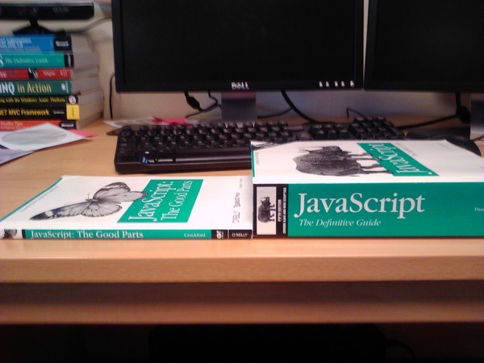

JavaScript «the useless parts» ?
]

???

- Quand on voit ça on comprend pourquoi Orelsan comprend rien
- Definitive Guide = JS + DOM + HTML/CSS + JQuery

---

# Où j'en suis...

.center[]

???

- Voilà un peu où j'en suis
- Un peu blasé par tout ce qui se passe dans l'écosystème JS
- Je ne peux pas m'empêcher de suivre ce qui se passe.

---

# Je ne suis pas tout seul !

.center[
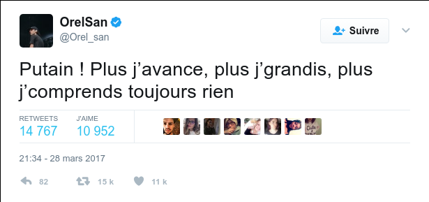

[Orelsan et JavaScript](https://twitter.com/Orel_san/status/846701911126372352)
]

???

## Orelsan se pose des questions !

- JavaScript what ?
- ECMAScript c'est quoi ?
- Bouge pas, on va répondre à tout ça

---

class: impact

# JavaScript

---

# 1995: naissance de JavaScript

.center[]

???

- Création de JavaScript pour Netscape en 1995

---

# 1997: ECMAScript

.center[

[Site officiel](https://www.ecma-international.org/publications/standards/Ecma-262.htm)
]

???

- ecma = asso pour standardization de l'information et des systémes de communication
- ISO-9660 (CDROM), C\#, Dart, Office Open XML format
- ECMA-262 / TC39: ECMAScript

---

layout: true
template: basic

# 2008 / Il était une fois...

---

.center[

2008 - 2010: n00b du JS !
]

???

- Pendant 2 ans et demie je suis fullstack (LOOOOOL)
- A cette époque je commence à faire du Java (et je pige pas toujours grand chose)
- Et c'est pareil pour le JS
- Vous avez remarqué, l'année colle pas, effectivement je suis un peu plus agé
- Ça montre un peu mon niveau en JS !

---

.center[

]

???

- Je suis un dev jQuery
- Je copiais les libs dans les projets...
- Et je les modifiais !
- Et c'était cool !

--

- Je copiais les libs dans les projets...

--

- Et je les modifiais !

--

- Et c'était cool !

---
template: basic

# 2009: ES*

- (avant: préhistoire)
- ES5 !

???

- Bon ok j'ai sauté les moutures précédentes
- ES5 sort, il deviendra la cible par défaut quand on transpile
- À cette époque j'ai encore des projets pour IE6 donc je code comme je peux ^^

---

layout: true
template: basic

# 2010 / Il était une fois...

---

.center[

2010 - 2011: thug life !
]

???

- Donc après un peu plus de 2 ans, je connais quelques trucs et je suis content
- Et je vais au Japon avec Madame avec un visa vacances travail...
- qui devient un visa vacances tout court
- Et là...

---

.center[

]

???

- Je découvre Node.js (y'a des gens qui en faisaient à cette époque ?)
- Je fais une grosse veille front
- (slide.next) C'est quoi la veille

--

- Je fais une grosse veille front

---
template: basic
class: impact-section

# (Veille

---

layout: true
template: basic

# Veille

---

## C'est quoi ?

> C'est le temps que je passe à slacker sur l'internet pour essayer d'être à jour.

???

- On a besoin d'être à jour !
- Je suis curieux donc j'ai pleeeein de news à lire (ça agace madame)

---

## Sources ?

- Twitter
- Reddit
- RSS

???

- Vous en avez d'autres ? HN ?
- Les articles de blogs (si t'es pas sur medium t'es pas crédible)
- Les confs et meetups

---

## J'y passe du temps...

- Dès que je me lève
- Dans les transports
- Et au boulot !

???

- moins de 2 heures sur le téléphone
- pas mesuré au boulot (ou alors j'ai pas le droit de dire que je glande parfois)
- ça fait quand même beaucoup de temps perdu...
- (slide.next) Donc comment en gagner ? Ou ne pas en perdre autant ?

---

## Ne pas perdre son temps

- Filtrer les sources
- «Je connais» => suivant !
- «Je n'en ai pas besoin» => suivant !
- A lire plus tard... Ou jamais ?

???

- Supprimer Hackers News / Twitter / Reddit ?
- Il faut éviter les infos en double !
- Faire le ménage dans les gens qu'on suit
- Apprendre à ne pas tout traiter
- Wallabag / Pocket => utilité pour la veille ?

---

## Donc...

.huge[
> Il faut savoir dire qu'on ne sait pas, mais il ne faut pas ne pas savoir apprendre.
]

???

- On a le droit de rater des trucs
- Il faut apprendre à apprendre pour monter en compétence rapidement sur quelque chose.
- Ça fait partie de notre boulot: apprendre avec la doc, les sources, un POC...
- On doit pouvoir appréhender quelque chose de nouveau rapidement.

---

## Et ailleurs ?

- **Design**: y'a pas de veille à faire, on copie Apple épicétou :p

???

- Attention, troll !
- **Design**: y'a pas de veille à faire, on copie Apple épicétou :p
- **Java**: y'a pas de veille à faire, on met Spring épicétou :p
- **Haskell**: papiers de recherche :p

--

- **Java**: y'a pas de veille à faire, on met Spring épicétou :p

--

- **Haskell**: papiers de recherche :p

---

> En gros Angular puis React puis Angular 2 puis React 2 enfin React 100 puis bla bla bla...
 Alors que "dans une grande majorité" de nos missions le travail être peut réalisé avec n'importe lequel et même en vanilla. 
 Juste nous développeurs qui sommes sur-informés de tout ce qui se passe dans la planète des géants et qui nous concerne peu au quotidien.

([Rominou](http://twitter.com/rmat0n))

---

layout: false
class: impact-section

# )

???

Fin de parenthèse sur la veille :)

---

layout: true
template: basic

# 2011 / Il était une fois

---

.center[

2011 - 2014: je suis une princesse
]

???

- Je reviens dans la boîte précédente
- Toujours fullstack !
- Gros penchant pour le «front»
- Front !== JS
- J'arrive même à faire un peu de gestion de projet

---

.center[
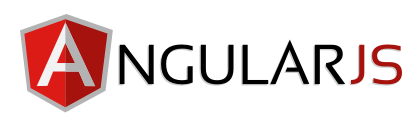
]

???

- Je suis un dev JavaScript et j'apprend AngularJS
- Je build avec Grunt
- Je gère mes dépendances avec bower
- Je build avec Gulp

--

.col-4.center[

]
.col-4.center[

]
.col-4.center[

]

---

layout: false
template: basic

# 2014 / Il était une fois

.center[
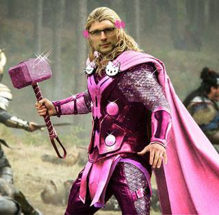

SFEIR me trouve !
]

???

- 2014: Sfeir me trouve
- Je suis reconnu comme pas trop un n00b
- coming out: JE SUIS DÉVELOPPEUR
- Mais je suis front donc je fais du coloriage et j'aime le rose
- Je commence à aller à des meetups comme un fou, comme un soldat, comme une star de cinéma

---
template: basic
class: impact-section

# (Communautés:

---

layout: true
template: basic

# Communautés

---

## Partout !

- Dans les meetups et les confs
- Autour des produits
- Sur l'internet mondial
- Dans l'entreprise

???

- Dans les meetups et confs
- Autour des produits
- Dans l'entreprise: plutôt cool
- Sur l'internet mondial: euuuh what ?

---

## Pour une communauté en bonne santé

- Savoir vivre

???

- Savoir vivre = civilité: respect, politesse (Ensemble de règles de vie en communauté)

--

- Savoir être

???

- Savoir être: production d'actions adaptées

--

- Savoir faire

???

- Savoir faire: connaissance des moyens pour accomplir une tâche, production de valeur pour la communauté

--

- 🚨 Attention: majorité silencieuse / minorité loquace

???

- Certains membres de la communautés sont influents (on y revient bientôt)
- On prend une direction bizarre...

---

## «C'est génial»

.center[

]

???

- On a tendance à trouver n'importe quoi génial
- On se méprend sur le «génie»
- Bien sûr, on ne les connait ou reconnait pas tous
- Vous vous rappelez de Flux, le pattern réinventé par Facebook ? => shitload de libs
- J'ai vu un collègue (je caricature) jeter le bouquin du Gang of Four dans une prez sur Rx genre «c'est has been»

---

## Les fanboys

.center[
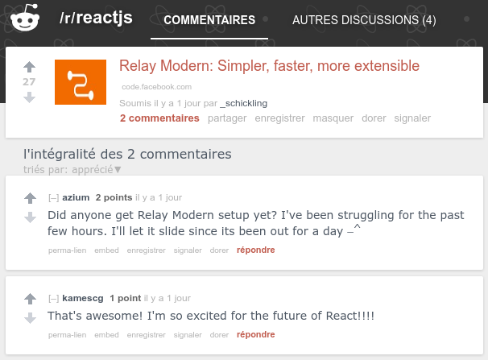
]

???

- Objectivité: c'est génial parce que c'est génial.
- Nous sommes des advocates sans gain
- On pousse tel ou tel produit en jugeant la boîte ou les devs qui le portent
- Il faut challenger les choses
- A-t'on le droit de critiquer ?

---

## Les advocates

.center[
[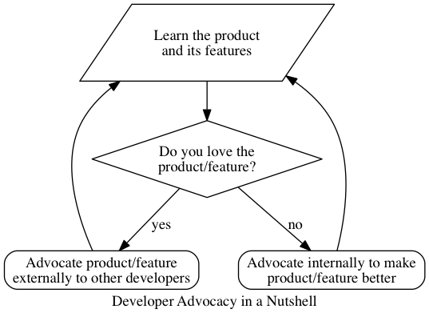](https://developer.ibm.com/clouddataservices/2015/10/14/one-year-at-ibm-as-a-developer-advocate/)
]

???

- 2 types d'advocate chez IBM...
- Externe: ceux qu'on voit, ce sont ceux qui marketent
- Interne: ceux qu'on ne voit pas, puisqu'ils remontent des soucis.
- Pas de retour d'XP avec les problèmes rencontrés et les solutions dans les prez advocates.
- Allez-vous toujours voir les mêmes prez des mêmes «advocates» puisqu'ils ne sont pas objectifs ?
- Developer Advocate, c'est du marketing qui parle aux développeurs.

---

## Les thought leaders

C'est un jeu ! Trouvez qui je suis !

- Je suis une rockstar du JavaScript, l'orienté objet c'est nul faut faire du fonctionnel, et n'oublie pas de t'inscrire à mon cours de JS.

???

## C'est un jeu, trouvez qui je suis...

- Eric Elliott

--

- Je suis Docteur, je travaille sur l'évolution du JavaScript, et je vends des t-shirts pour promouvoir mon blog.

???

- Dr Axel Rauschmayer

- Certaines «stars» ont les plein pouvoirs sur les devs
- Plein pouvoirs = responsabilités
- Responsabilité = ne pas pousser les devs à faire n'importe quoi sur un projet
- Vous ne devez pas suivre aveuglément la dernière tendance sur twitter / medium !

---

## Et nous !

.center[

]

???

- En fait on est certainement un peu tous un mélange de ce qu'il y a avant
- Et un peu ça aussi.
- «hey je vais changer le monde»
- «okay je suis juste un gars dans un cube»...
- En fait ma case en ce moment c'est: le grognon.
- J'aimerai écrire des trucs positifs mais y'a tellement de trucs qui me fatiguent...

---

## Aimez-vous les uns les autres, bordel

.center[

]

???

-  J'ai lu ce truc là il y a quelques mois et c'était cool
-  On manque vraiment de respect dans les communautés, surtout sur internet
-  Soyez bons entre vous, dès maintenant et sans attendre en retour

---

layout: false
class: impact-section

# )

???

Fin de parenthèse sur les communautés :)

---

layout: true
template: basic

---
layout: true
template: basic

# 2015

---

## ES2015 (anciennement ES6)

arrow functions, class, destructuring, generators, modules, promise, proxies, template strings...

???

- grosse update donc temps d'adoption assez long

---

## Aux sources de la JavaScript Fatigue

.center[

]

???

- On est il y a 1 an et demie en gros
- déjà 3 refactos de projets JS pour certains :p
- Eric Clemmons
- TL;DR
    - JS et react c'est cool mais...
    - Trop d'outils
    - Les outils actuels = pas la solution (boilerplate / generateurs)
    - Trop d'API, trop de configuration
    - Besoin de plus d'abstraction et moins de code
    - Il présente quelques outils qui ouvrent vers un meilleur avenir (pas vraiment utilisés)

---

layout: false
template: basic

# 2016

## ES2016 (ES7)

array.prototype.includes, exponential operator

???

- Toute petite release !

---

layout: true
template: basic

# 2017 / Il était une fois...

.bottom-bar[
  @SiegfriedEhret / SnowCamp 2018
]

---

.center[

En mode Dexter.
]

???

- En mode Dexter !
- Y'a des moments où j'ai des cheveux
- mais comme je les perds je fais pas trop le malin.
- Bref...

---

- Je suis un dev JS

???

- En 2015-2017
- Je fais du angularJS
- Je manage avec npm
- frameworks: react, backbone, vue et même du Polymer !
- je build avec gulp puis webpack mais j'y arrive pas
- je build avec webpack et j'y arrive
- je dois essayer rollup parce que «facebook migre des projets dessus c'est forcément bien»
- A l'aide !

## Et tout ça c'est avant la sortie d'ES2017

--

- Je gère mes dépendances avec npm

--

- Je découvre plein de trucs

--

- 💥 Boum, fatigueJS.

---
template: basic

# 2017 / ES2017

async functions, Object.values / entries, String padding...

???

- ES2017
    - async functions (parce que generateur + promise ça ne suffisait pas)
    - String padding (leftpad LOL)
- Et ça va continuer !

---
layout: true
template: basic

---

# Le futur ?

.col-6[
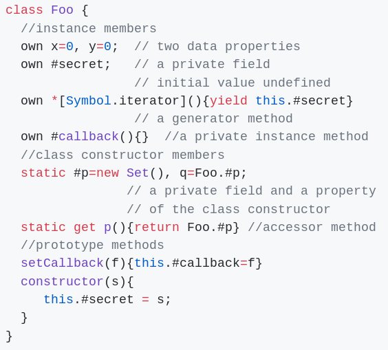
]
.col-6[
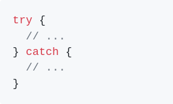

↑ [Optional Catch Binding](https://github.com/tc39/proposal-optional-catch-binding)
]

← [Orthogonal classes](https://github.com/erights/Orthogonal-Classes)

???

- C'est un vrai truc: Orthogonal Classes
- (slide.next) Plus sérieusement...

---

# En vrai: le futur !

- [Object rest / spread](https://github.com/sebmarkbage/ecmascript-rest-spread) (stage 3)
- [Async iteration](https://github.com/tc39/proposal-async-iteration) (stage 3)
- [Class decorators](https://github.com/wycats/javascript-decorators) (stage 2)
- [Observable](https://github.com/tc39/proposal-observable) (stage 1)

[En savoir plus (github.com/tc39/proposals)](https://github.com/tc39/proposals)

???

- Mais c'est quoi ces «stages» ?

---

# Stages ?

[TC39 / Stages](https://tc39.github.io/process-document/) / [https://tc39.github.io/process-document/](https://tc39.github.io/process-document/)

- Stage 0 «Strawman»
- Stage 1 «Proposal»
- Stage 2 «Draft»
- Stage 3 «Candidate»
- Stage 4 «Finished»

???

- Stage 0 «Strawman» (spec dans un format libre)
- Stage 1 «Proposal» (proposition formelle)
- Stage 2 «Draft» (1er brouillon de la spec, ne signifie pas que ça finira dans le standard !)
- Stage 3 «Candidate» (spec quasi finie, en besoin de tests et d'implémentations, et de retours !)
- Stage 4 «Finished» (go pour le standard !)

---

# On part en prod ?

## À partir de quel «stage» ?

???

- Stage 4: ok !
- Stage 3: mmmmm. On a global en stage 3, mais il est en pause pour une histoire de changement de nom car conflit ! (casse flickr).
- Stage 2 et en dessous: NON, rappel: [Object.observe](https://esdiscuss.org/topic/an-update-on-object-observe)
- Bien sûr, dépend de la version de node / browsers cible !

--

- [Object.observe](https://esdiscuss.org/topic/an-update-on-object-observe) abandonné en stage 2
- [global](https://github.com/tc39/proposal-global) en pause en stage 3

---

# T'inquiète gros, y'a... Babel !

.center[

[«Babel is a JavaScript compiler.»](https://babeljs.io/)
]

???

- pas toujours compliant avec la spec
- Il y a des trucs non polyfill-able.
- comment vérifier que l'output correspond bien à ce que je veux faire ? => les tests (quand on en a)

---

# T'inquiète gros, y'a... TypeScript !

- Et [flow](https://flow.org/)

--
- Et [purescript](http://www.purescript.org/)
- Et [reasonml](https://reasonml.github.io/)
- Et [clojurescript](https://clojurescript.org/)
- Et [elm](http://elm-lang.org/)

--
- [etc (jashkenas/coffeescript/wiki/List-of-languages-that-compile-to-JS)](https://github.com/jashkenas/coffeescript/wiki/List-of-languages-that-compile-to-JS) (17 pages !)

???

- Okay. Cool story bro.
- TypeScript est marketé comme un superset d'ES2015. C'est faux.
- Je suis convaincu que si on veut amener des types dans le JS, c'est en étant nazi sur les types.
- Et avec TypeScript, l'intro c'est «renomme ton fichier en .ts et voilà»
- TS résoud les types si tu es super strict toi même, mais tu peux l'être en JS aussi

---

layout: true

.bottom-bar[
  @SiegfriedEhret / SnowCamp 2018
]

# Écosystème

---

## Librairies, frameworks

.center[

]

???

- Je ne sais pas pour vous, perso je ne m'y retrouve pas toujours...
- Cool, mais comment choisir ?
- En venant écouter des prez ! Ou sur les réseaux de l'internet mondial.

---

## Frameworks

.col-6[
### Mis en valeur

- [Angular](https://angular.io/) (#ItsJustAngular) 
- [Polymer](https://www.polymer-project.org)
- [React](https://facebook.github.io/react/)
- [Vue](https://vuejs.org/)
]
.col-6[
### On s'en fout ?

- [Aurelia](http://aurelia.io/)
- [Backbone.js](http://backbonejs.org/)
- [Ember](http://emberjs.com/)
- [Inferno](https://www.infernojs.org/)
- [Mithril](http://mithril.js.org/)
- [Preact](https://preactjs.com/)
- [Riot](http://riotjs.com/)
- [Svelte](http://svelte.technology/)
- ...
- [hyperapp](https://hyperapp.js.org/) 
- Celui qui est sorti le mois dernier !
]

???

- Bon les poids lourds c'est pas déconnant
- Mais polymer, sérieux ? Qui en fait ?
- Surtout que chaque framework se vend comme «le meilleur», donc s'ils sont tous meilleurs, comment qu'on s'en sort ?
- On s'en fout de la colonne de droite ou pas ?
- Et ces projets servent à qui / à quoi ?

---

## Libz

.col-6[
### Mis en valeur

- [RxJS](https://github.com/ReactiveX/rxjs)
- .small[[Monet](https://cwmyers.github.io/monet.js/)]
]
.col-6[
### On s'en fout ?

- [Bacon](https://baconjs.github.io/)
- [JQuery](https://jquery.com/)
- [Lodash](https://lodash.com/)
- [Ramda](http://ramdajs.com/)
- [Underscore](http://underscorejs.org/)...
]

???

- jQuery résoud encore plein de problèmes et est toujours super présent.
- Lodash / Underscore sont très utilisés
- Et les libs qui font croire qu'on fait du fonctionnel ?

---

## Build/Scaffold/Bundle

.col-6[
### Mis en valeur

- [Gulp](http://gulpjs.com/)
- [Yeoman](http://yeoman.io/)
- [Webpack v 1](https://webpack.github.io/docs/) 
- [Webpack v 2](https://webpack.js.org/)
- [Webpack v 3](https://webpack.js.org/)
- [Webpack v 4](https://webpack.js.org/) (bientôt ?)
]
.col-6[
### On s'en fout ?

- [Broccoli](http://broccolijs.com/)
- [Brunch](http://brunch.io/)
- [Fountain](http://fountainjs.io/)
- [FuseBox](http://fuse-box.org/)
- [Grunt](http://gruntjs.com/)
- [Parcel](https://parceljs.org/)
- [Plop](https://plopjs.com/)
- [Rollup](http://rollupjs.org/)
]

???

- Tout le monde les utilise
- Où ils sont dans les confs ?
- On ne parle que de webpack
- On va bientôt parler de Rollup puisque facebook migre certains projets dessus
- Question sans réponse: est-ce parce qu'Angular est très copain avec Webpack ?

---

## Ce n'est pas tout !

- [npm](https://www.npmjs.com/) (ou
  [ied](http://gugel.io/ied/), ou
  [pnpm](https://pnpm.js.org/), ou
  [turbo](https://medium.com/@ericsimons/introducing-turbo-5x-faster-than-yarn-npm-and-runs-natively-in-browser-cc2c39715403), ou
  [yarn](https://yarnpkg.com/)...)
- [bower](https://bower.io/)

???

- On s'intéresse à Yarn juste parce que Facebook l'a sorti
- Bower c'était intéressant (gestion des dépendances, utilisé que pour Polymer)
- Et y'a un point commun dans tout ça: c'est open source

---

## En parlant de npm...

.center[
[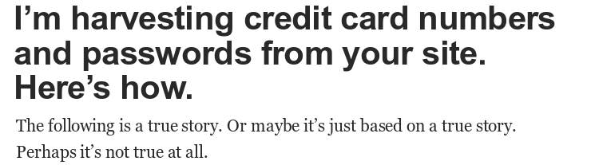](https://hackernoon.com/im-harvesting-credit-card-numbers-and-passwords-from-your-site-here-s-how-9a8cb347c5b5)

[source](https://hackernoon.com/im-harvesting-credit-card-numbers-and-passwords-from-your-site-here-s-how-9a8cb347c5b5)
]

???

- leftpad
- les paquets disparus début janvier
- La sécurité ?
- npm ne check **rien**, les scripts (postinstall...) permettent d'exécuter n'importe quoi...

---

layout: true
template: basic

---

template: basic
class: impact-section

# (Open Source

---

layout: true
template: basic

# Open source

---

- Quasiment tout ce que je mentionne est open source...

???

-  Répondez bien sinon vous allez foirer mon effet
-  Qui en fait => contributeur ? Mainteneur ?
-  Qui a un projet open-source ?
-  Avec plus d'un contributeur ?
-  Avec plus que soi-même en utilisateur ?
-  Qui répond à un problème non résolu ?

--

- Qui en utilise ?

--

- Qui en fait ?

---

> Open Source software is software that can be freely accessed, used, changed, and shared (in modified or unmodified form) by anyone. ([Open Source Initiative FAQ](https://opensource.org/faq))

???

-  Collaboration ouverte: ouverture aux participations, et la valeur produite est accessible aux contributeurs et aux non contributeurs de façon égale.
-  Si possible: organisation, documentation. Ça doit être public.
-  Licence ouverte: utilisation d'une licence reconnue par l'open source initiative pour permettre le partage, la modification.

--

-  Collaboration ouverte
--

-  Accès aux sources
--

-  Licence ouverte
--

-  [Debian's "Social Contract" with the Free Software Community (1997)](https://lists.debian.org/debian-announce/1997/msg00017.html)

---

## Danger !

.center[
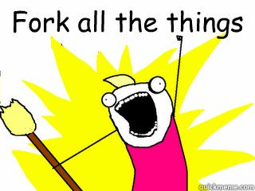
]

???

- Fork all the things.
- On préfère faire son truc plutôt que d'améliorer l'existant
- avec Github, npm, c'est tellement facile de copier et pousser n'importe quoi

---

## Le code

.center[
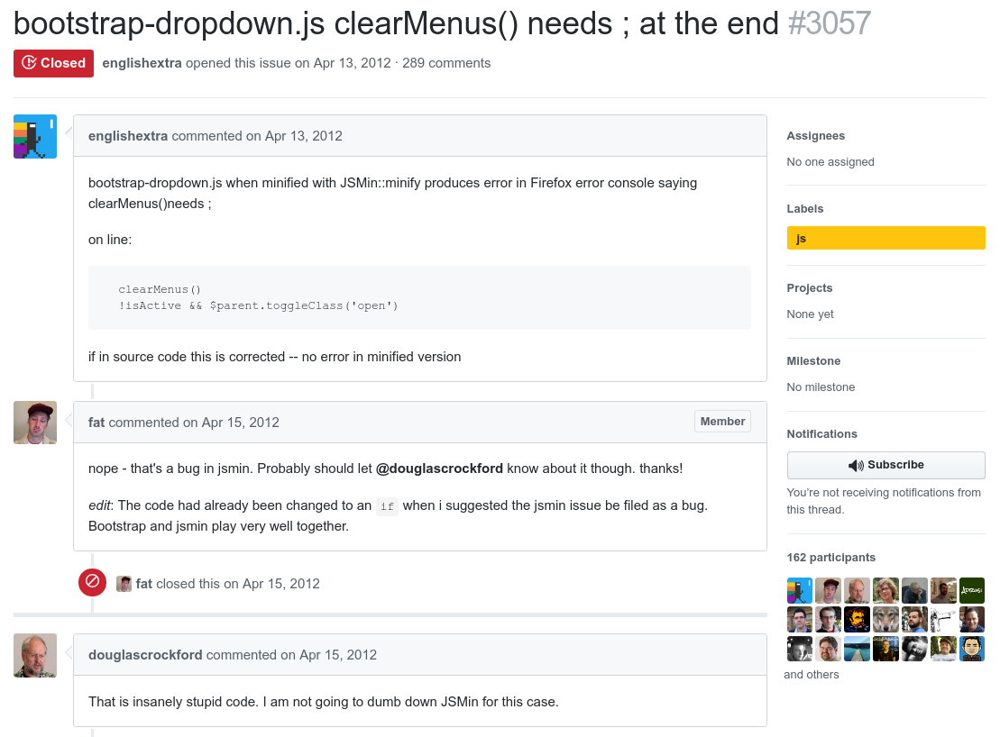

[Guerre de ;](https://github.com/twbs/bootstrap/issues/3057)
]

???

- Aaaaah c'est pas facile.
- Il faut avoir un outillage pour tout vérifier !
- Linter, test, CI sont obligatoires.
- Notre code ne doit pas péter quand il est intégrer dans les build tools des utilisateurs
- Pour le lol: open source = participation au concours du plus grand nombre de dotfiles dans un projet :p

---

## Release, versioning

-  major.minor.patch
-  React
-  Angular(JS)
-  «Semver est une machine à casser les choses» (Rich Hickey)

???

-  Semantic versioning: majeure.mineure.patch
-  Les version 0.x.x: bordel, non stable, pas prod ready
-  quand on release du JS on release sur npm, qui se base sur semver (on y revient juste après)
-  React: 0.14 à 15, j'ai trouvé ça rigolo. Rappel: <1.0.0 c'est pas stable / prod ready !
-  Angular: 1.x reste en 1.x, semantic versioning à partir de la 2.
-  MAIS c'est sur npm !
-  Par défaut dans npm, on est en \^, donc les versions mineures sont mises à jour quand on installe de nouveau
-  => ça peut péter (ça a pété avec Angular 1.6)
-  Quote: semver facilite la création de changements cassants

---

## Documentation

.center[

]

???

- Il faut maintenir plusieurs versions en général
- Il faut couvrir ce que le logiciel permet
- Il faut être compréhensible
- Quand je dis que c'est pas mon taf et que dans l'open source je suis uniquement intéressé pour fixer des typos, je ne blague pas.

---

## Saurez-vous retrouver les projets concernés ?

- Quand ta doc est foireuse, autant tout refaire... **Pour la version suivante**.

???

- Webpack 1: toujours très moyenne, et celle des loaders aussi ! Y'a du mieux maintenat
- Angular: annoncé en 2014, sorti en 2016 et pas terminé (la classe Http est toujours expérimentale...), la doc est très en retard pour le JS, et il y a de gros manques mêmes pour TypeScript. Aujourd'hui, il y a **uniquement** la doc pour TypeScript !
- C'est dommage de perdre une partie de l'audience à cause de la documentation.

--

- Après 2 ans et une release pas terminée, faut commencer à mettre la doc à jour... **Pour TypeScript**.

---

layout: false
class: impact-section

# )

???

Fin de parenthèse sur l'open source :)

---

layout: false
template: basic
class: impact-section

# Revenons à l'écosystème JS

---

layout: true
template: basic

---

# Cycle de vie

.center[
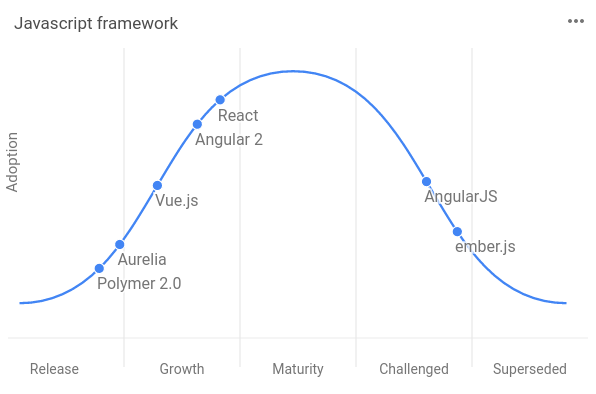

[stateofdev.com](https://stateofdev.com/c/javascript)
]

???

-  stateofdev: stats sur le cycle de vie des frameworks
-  Données de on ne sait pas trop où
-  mais si c'est sur internet c'est vrai.
-  Votre framework préféré va certainement disparaître un jour
-  Il y a des chances que vous ne soyez pas devenu expert dessus pendant qu'il est encore à la mode.

---

# .highlight[2017] -> 2018 / Direction

.center[
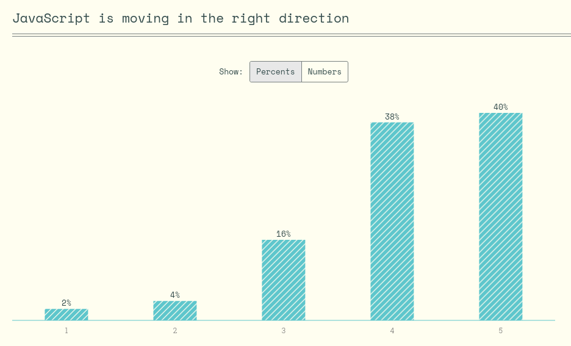

[stateofjs.com](http://stateofjs.com/)
]

???

- 2017
- La bonne direction
- 78%

---

# 2017 -> .highlight[2018] / Direction

.center[
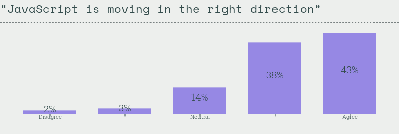

[stateofjs.com](http://stateofjs.com/)
]

???

- 2018
- La bonne direction
- 81%

---

# .highlight[2017] -> 2018 / Complexité

.center[
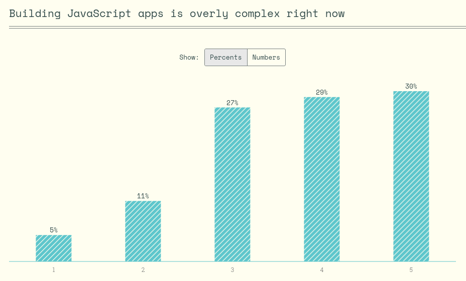

[stateofjs.com](http://stateofjs.com/)
]

???

- 2017
- Complexité
- 59%

---

# 2017 -> .highlight[2018] / Complexité

.center[
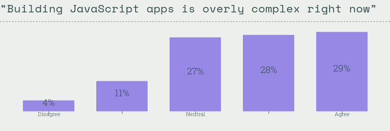

[stateofjs.com](http://stateofjs.com/)
]

???

- 2018
- Complexité
- 57%

---

# .highlight[2017] -> 2018 / Changement

.center[
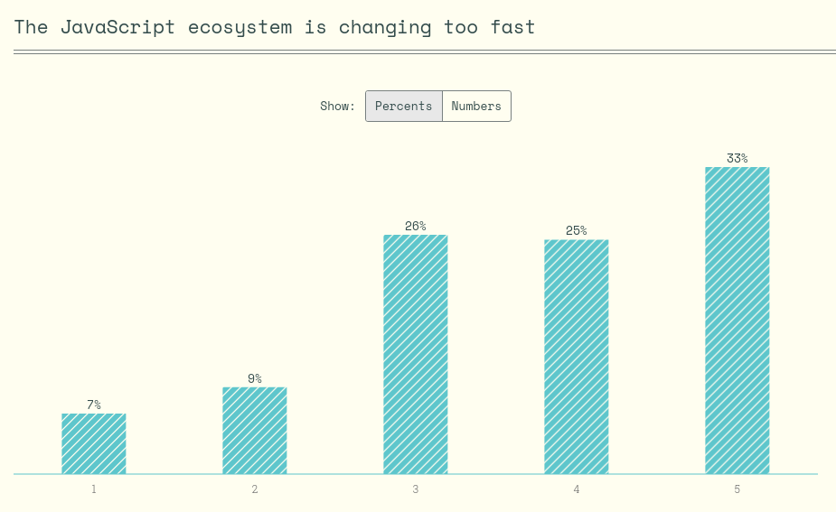

[stateofjs.com](http://stateofjs.com/)
]

???

- 2017
- Changement
- 58%

---

# 2017 -> .highlight[2018] / Changement

.center[
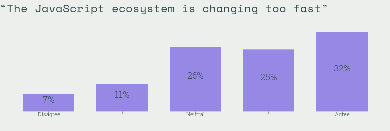

[stateofjs.com](http://stateofjs.com/)
]

???

- 2018
- Changement
- 57%

---

# .highlight[2017] -> 2018 / Grosse éclate ?

.center[
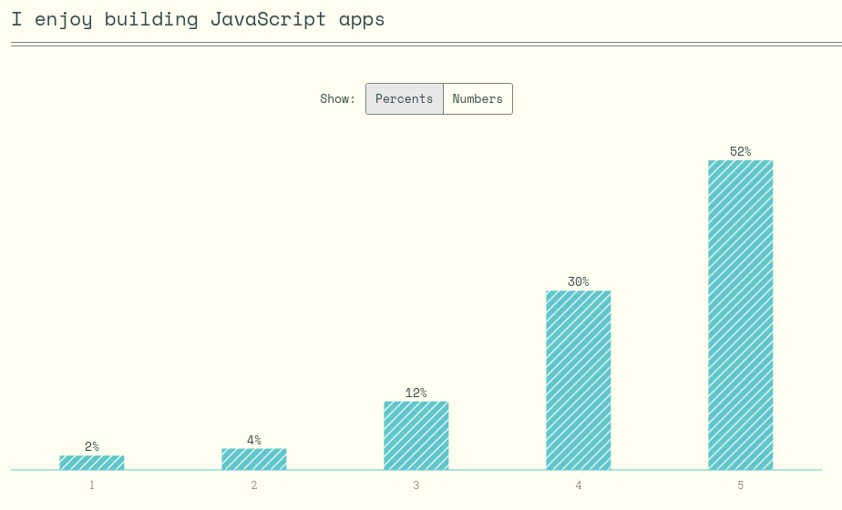

[stateofjs.com](http://stateofjs.com/)
]

???

- 2017
- Grosse éclate ?
- 82%

---

# 2017 -> .highlight[2018] / Grosse éclate ?

.center[
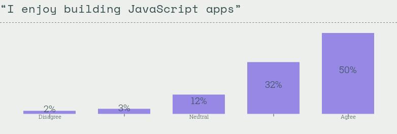

[stateofjs.com](http://stateofjs.com/)
]

???

- 2018
- Grosse éclate ?
- 82%

---

# 2018 / Il est une fois...

Où j'en suis aujourd'hui ?

???

- Je fais du Go
- Je vais du Vue
- Pour l'instant ça va !
- Je suis ce qui se fait quand même et je ne suis pas rassuré.

--

.col-6.center[

]

--

.col-6.center[

]

---

layout: true

background-image: url(./images/back-to-the-future.gif)

---

???

- Et après ?
- Dans Retour Vers Le Futur ils n'ont pas besoin de route
- Et en JavaScript ?

---

layout: true
template: basic

---

# 2020 / Il sera une fois...

.col-6.center[

]
.col-6[
- JS ?
- Frameworks ?
- Fatigue ?
]

???

- En 2020 il y a les JO à Tokyo
- Est-ce que je ferai du JS ? Plutôt oui.
- Est-ce que nous ferons du JS ? Plutôt oui.
- Qui se voit toujours développeur ? (moi oui)
- Qui se voit toujours dans les mêmes technos ? (moi peut être)

---

# 2020 / Web Assembly ?

.col-6.center[
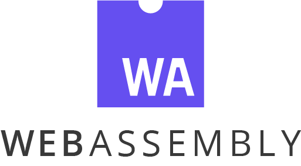
]

???

- Et Web Assembly ?
- Les cas d'utilisation listés sont assez spécifiques (ils mentionnent GWT, what ?)
- Pour faire des formulaires et clignoter des boutons on n'a pas besoin de ça...
- ... Et pas non plus de typage, sériousli.

--

.col-6[
- Jeux
- Imagerie / vidéo
- Virtualization
- Encryption
- ...
- GWT ? o_O

(source: [use cases](http://webassembly.org/docs/use-cases/))
]

---

# 2024 / Il sera une fois...

.col-6.center[

]
.col-6[
- JS ?
- Frameworks ?
- Fatigue ?
]

???

- En 2024 il y a les JO à Paris
- Est-ce que je ferai du JS ? Non.
- Est-ce que nous ferons du JS ? Non ?
- Qui se voit toujours développeur ? (moi oui)
- Qui se voit toujours dans les mêmes technos ? (moi non)

---
class: impact-section

# 2024 / Comment va-t'on se promener sur l'internet mondial ?

???

- Avec quel(s) butineur(s) ?
- Allons-nous tout commander à la voix ? (je n'espère pas)
- Aurons-nous tout réécrit en rust ? (ce sera une erreur)
- Où aurons-nous toujours les mêmes débats avec 3 frameworks principaux et 200 qui essaient de survivre ?
- Le champ des possibles WASM ? L'ouverture à divers langages pour compiler vers WASM / JS ?
- Les IA et les Algorithmes qui vont peur vont naviguer pour nous de toutes façons, non ?

---

layout: true
template: basic

---

template: basic
class: impact-section

# (Développeur·euses

---

layout: true
template: basic

# Développeur·euses

---

.center[
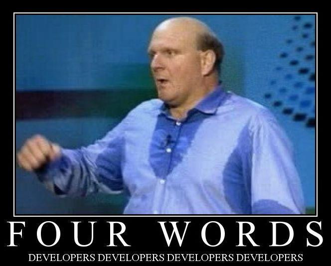
]

???

-  On s'est posé la question avec quelques collègues
-  Pas tous le même avis
-  Mais on fait souvent le même chemin...
-  (slide.next) A commencer par une formation

---

## Éducation

-  Le Droit à l'Éducation est un des Droits de l'Homme
--

-  Un bon enseignement => un bon développeur

???

-  Droit à l'Éducation: accès aux ressources, droits de questionner et de réfléchir, droits de développer ses compétences individuelles et collectives
-  Bon enseignement => bon développeur
    -  Projets individuels et en équipe
    -  Cours théoriques (validation de ce qu'on a cherché, ouverture d'esprit)
-  Il y a des choses qui manquent chez certains développeurs
-  J'ai un master en informatique, avec des formations pas toujours intéressantes mais ça m'a permis d'être à peu près ouvert et de réfléchir avant de choisir tel ou tel truc.
-  (slides.next) Ensuite... Si on préfère changer de techno tous les 6 mois on n'a pas le temps d'assurer les bases...

---

## Dev = Jon Snow ?

.center[
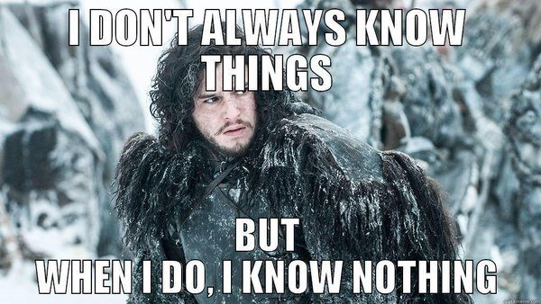
]

???

- On nivelle par le bas en ce moment

---

## Dev = Jon Snow ?

> «Write pseudocode that reverses a linked list» as an interview question 
 I would say «tell me what a linked list is?»

[source](https://twitter.com/ryanflorence/status/836959462661341184)

???

-  A la question «écrivez un pseudo code pour inverser une liste chaînée»
-  Ryan Florence (développeur de react router et formateur react) répond «c'est quoi une liste chaînée»
-  Le fil continue, je ne dis pas qu'il ne sait pas, mais il y a des choses de base à connaître
-  La liste chaînée en fait partie !

---

## Dev = Jon Snow ?

> Hello, my name is David. I would fail to write bubble sort on a whiteboard. I look code up on the internet all the time. I don't do riddles.

[source](https://twitter.com/dhh/status/834146806594433025)

???

-  DHH: créateur de Ruby on Rails
-  Pourquoi on n'accepte pas les exercices sur papier / tableaux ?
-  On ne peut pas réfléchir sans duckduckgo ou stack overflow ?
-  Si on te demande une archi, tu la codes ou tu la couches sur papier ?
-  Plusieurs types de tri, avec perf / complexité différentes. Entendu il y a quelques temps «si j'ai besoin d'un tri je fais `npm install quicksort` et hop». Okay.

---

## Entretiens

.center[
[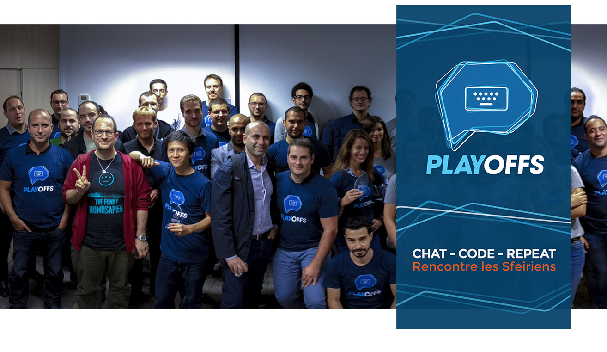](https://weare.sfeir.com/)
]

???

-  Playoffs
-  3 entretiens techniques avec 3 personnes
-  On essaie d'être à la limite du pair programming
-  Ça permet au candidat d'être testé et de tester
-  (soupirs) C'est sur PC
-  (slide.next) Pour nos projets, on a besoin d'outils

---

## Quelle est notre mission ?

-  Trouver la solution à un problème.

???

- Résoudre le problème du client, pas de toucher la nouille avec des technos hype

--

-  Challenger techniquement les décisions.

???

- En tant que dev, on apporte une expertise technique. Il ne faut pas écouter aveuglément le PO, le cdp, le coach agile qui ne font pas le même métier.

--

-  Imposer le temps de faire les choses correctement.

???

- Anecdote du dentiste de Romain: est-ce que tu laisserais ton dentiste te mettre une dent en bois pour 20 balles en attendant de fixer ça «un jour») => rattrapage de dette techniques

--

-  Il faut savoir dire non (cordialement).

???

- Nous ne devons pas accepter de faire les choses n'importe comment (dette, test, deploy à l'arrache...)
- Comme pour l'open source: Non: temporaire, oui: pour toujours !

---

## Rater sa vie

.huge[
> Si après 5 ans de dev tu passes pas manager, t'as raté ta vie. 
   
&mdash; Jacques Séguéla (ou pas)
]

???

-  On a quelque chose à apporter quand on a de l'expérience
-  Il faut lutter contre le Principe de Peter (tu vas évoluer jusqu'à bloquer quand tu n'es plus performant)

---

layout: false
class: impact-section

# )

???

Fin de parenthèse sur les devs :)

---

template: basic
class: impact-section

# La fin ?

---
layout: true
template: basic

---

# Traitement

## JavaScript

???

- Apprenez le JavaScript, les concepts avant les frameworks (y'a des dizaines d'années de recherche, on n'invente plus grand chose)
    - On finit par se bloquer sur une stack crédible pendant quelques mois
    - EXPERIMENTEZ, challengez ! Acceptez l'évolution !
    - La mode est à l'enrichissement de JS par des outils (TypeScript, flow, purescript).
    - Il faut connaître le JS quand même !
    - Il suivre les specs pour être à jour
    - Il faut connaître les outils
    - Il faut les défier, savoir dans quel cas les utiliser
    - Connaître plus d'un outil => avoir plus de possibilités
    - Mais connaître les outils ça demande du temps... Et de la veille !

--

## Veille

???

- Ne perdez pas de temps !

--

## Communautés

???

- Participons, apprenons et partageons, avec respect.

--

## Open source

???

- Ce n'est pas un but. Profitez-en si vous le pouvez !

--

## Développeurs

???

- Notre but c'est de résoudre la question de l'utilisateur.
- Ne cessons pas d'apprendre, soyons ouverts et entraidons nous !

---

# JavaScript === Escape game

.center[
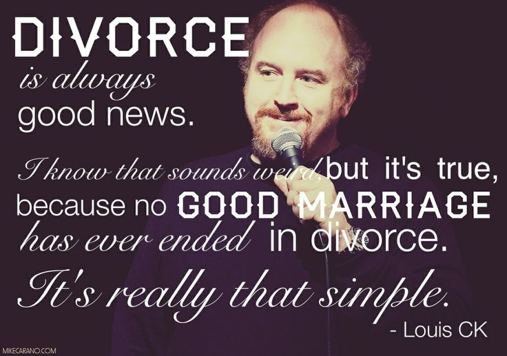
]

???

- Divorce is always good news.
- JavaScript c'est un gros piège dont il faut s'échapper.
- Il est plein de frameworks et d'outils qui prennent notre temps.
- Il faut s'en sortir pour rester zen.

---

# Magie / Cardistry

.col-4.center[

]

???

- Après avoir passé trop de temps sur YouTube à regarder des vidéos de magie
- Je m'y suis mis à cause de madame (cartes et un peu pièces)
- J'ai découvert aussi la Cardistry
- Et après quelques heures...

--

.col-4.center[

]

--

.col-4.center[

]

???

- Ça ne sert à rien mais c'est joli et ça change les idées !

---

template: basic
class: impact-section

# Merci ! Bisous !

## 😘
