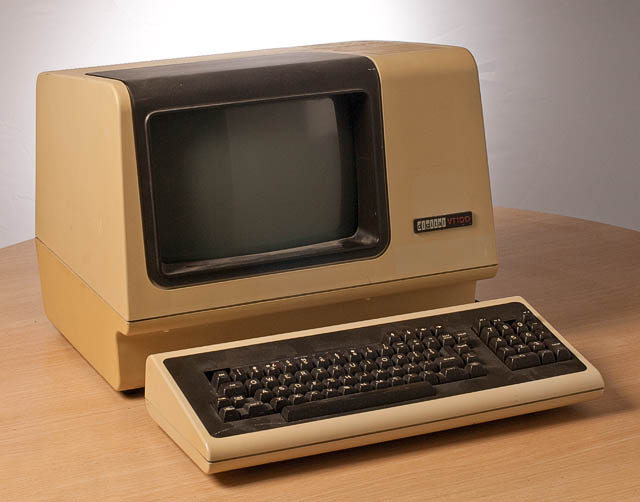

# Gagner des super-pouvoirs avec le terminal

Nous allons parcourir le monde merveilleux du terminal, en démarrant par le shell pour aller vers quelques applications bien pratiques.

Et des tips qui feront de vous la seule personne capable d'utiliser votre ordinateur.

Note: je ne répondrais pas au débat ultime: (neo)vim vs emacs :-P

## C'est quoi un terminal ?

## C'est quoi un shell ?

> Accroche toi au terminal, j'enlève le shell !

- bash
- zsh
- fish: https://fishshell.com/

## Super apps !

Terminal FTW !

- abook (carnet d'adresse): http://abook.sourceforge.net/
- feh (viewer d'images): https://feh.finalrewind.org/
- fzf (fuzzy finder): https://github.com/junegunn/fzf
- httpie (curl++): https://httpie.org/
- jq (json query): https://stedolan.github.io/jq/
- mpv (lecteur de vidéos, gif, youtube...): https://mpv.io/
- mutt (mail pour les vrais): http://www.mutt.org/
- offlineimap (pour avoir ses mails en local synchronisés): http://www.offlineimap.org/
- pass (ne croyez pas les services en ligne !): https://www.passwordstore.org/ et https://wiki.archlinux.org/index.php/Pass
- ranger (navigateur de fichiers): http://ranger.github.io/
- tig (client git de type sympa): https://jonas.github.io/tig/
- trash-cli (rm -rf c'est violent): https://github.com/andreafrancia/trash-cli
- z (cd++): https://github.com/rupa/z
- zathura (pdf): https://pwmt.org/projects/zathura

Il y a aussi l'alias `rmaton` qui vaut `git push --force-with-lease`

Et le meilleur pour la fin: thefuck ! https://github.com/nvbn/thefuck

## Pas eu le temps encore mais c'est prévu !

- khal (calendrier): https://lostpackets.de/khal/index.html
- taskwarrior (gestionnaire de taches): https://taskwarrior.org/
- w3m («browser»): http://w3m.sourceforge.net/
- youtube-dl (DL depuis n'importe quoi): http://rg3.github.io/youtube-dl/

## À vous !

Qu'est-ce que j'ai oublié ?
