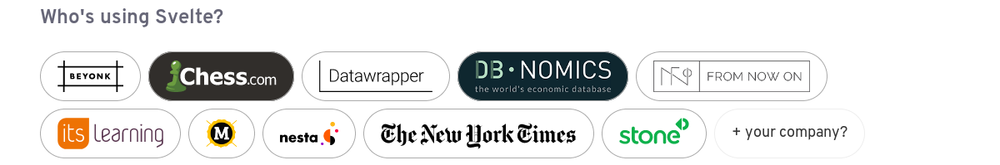

title: Svelte & Sapper
class: animation-fade
layout: true

<!-- This slide will serve as the base layout for all your slides -->
.bottom-bar[
  \#DevoxxFR
]

---

class: impact

# {{title}}
## Les frameworks qui vous veulent du bien.

---

class: impact

# Les gens 

## VS 

# Les apps JS...

---

## You suffer

## But why?

&mdash; Napalm Death - You Suffer

---

## Y'a de la richesse dans nos âmes

## Y'a de la misère dans nos yeux

&mdash; Pnl - Autre Monde

---

# Rich Harris (New York Times)

.col-6.twitter[

]
.col-6[
- [Ractive](https://ractive.js.org/)
- [Rollup](https://rollupjs.org/)
- [Interview](https://changelog.com/podcast/332)
]

---

# Svelte

- [svelte.technology (v2)](https://svelte.technology/): « The magical disappearing UI framework »
- [v3.svelte.technology (v3 - beta)](https://v3.svelte.technology/): « Cybernetically enhanced web apps »
- Pour démarrer une app: [sveltejs/template](https://github.com/sveltejs/template)
- Pour démarrer un composant: [sveltejs/component-template](https://github.com/sveltejs/component-template)

--



---

# Sapper

- [sapper.svelte.technology](https://sapper.svelte.technology/): « Military-grade progressive web apps, powered by Svelte »
- Pour démarrer une app: [sapper-template](https://github.com/sveltejs/sapper-template)
	- Rollup
	- Webpack

---

class: impact

# Demo time !


---

class: impact

# Ce qu'on en dit

---

## J'ai pas vraiment le temps mais je crois que je vais refaire une partie de mon outil de slides. [...] Je me dis que je tenterai bien svelte.

&mdash; [Hubert Sablonnière](https://twitter.com/hsablonniere)

---

## Très facile à faire arriver dans une codebase legacy : le coté "disappearing framework" révèle tout son avantage : le refactoring iteratif sans surcoût est complètement possible.

&mdash; [Augustin Chassine](https://twitter.com/0gust1) et [Quentin Lefevre](https://twitter.com/Hyerelle) .small[(Decathlon)]

---

# + / -

## C'est cool

- On n'embarque pas un framework (taille, perf)

--

- Expérience agréable.

--

- Sapper c'est génial.

---

# + / -

## C'est moins cool

- v2: rien 😛, v3 (beta) et ça bouge.

--

- Sapper encore en alpha et sans doc

--

- Peu de devs, peu de clients... Pour l'instant !

---

class: impact

# Merci !

.left[
- Code: [github.com/SiegfriedEhret/talk-svelte-sapper](https://github.com/SiegfriedEhret/talk-svelte-sapper)
- Slides: [frama.link/svelte-sapper](https://frama.link/svelte-sapper)
]

.col-4.left[
## whoami

- Siegfried Ehret
- [SonarSource](https://www.sonarsource.com/)
]
.col-4.twitter[

]
.col-4.left[
## Social

```
@SiegfriedEhret ALL THE THINGS !
```

- [twitter](https://twitter.com/SiegfriedEhret)
- [mastodon.ehret.me](https://mastodon.ehret.me/@SiegfriedEhret)
]